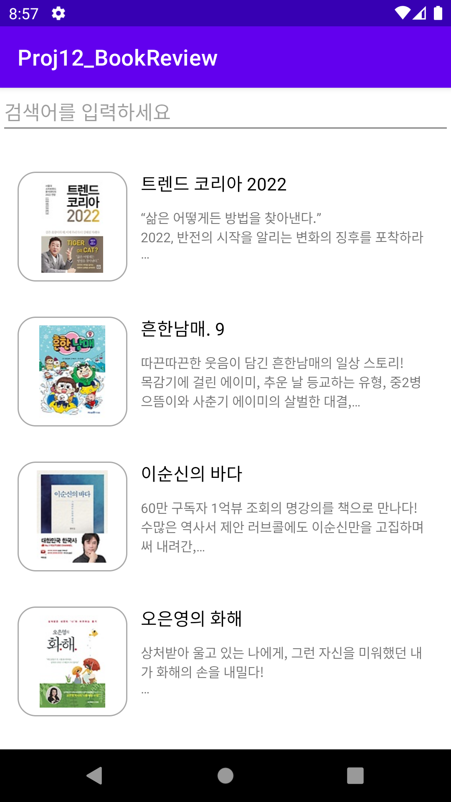
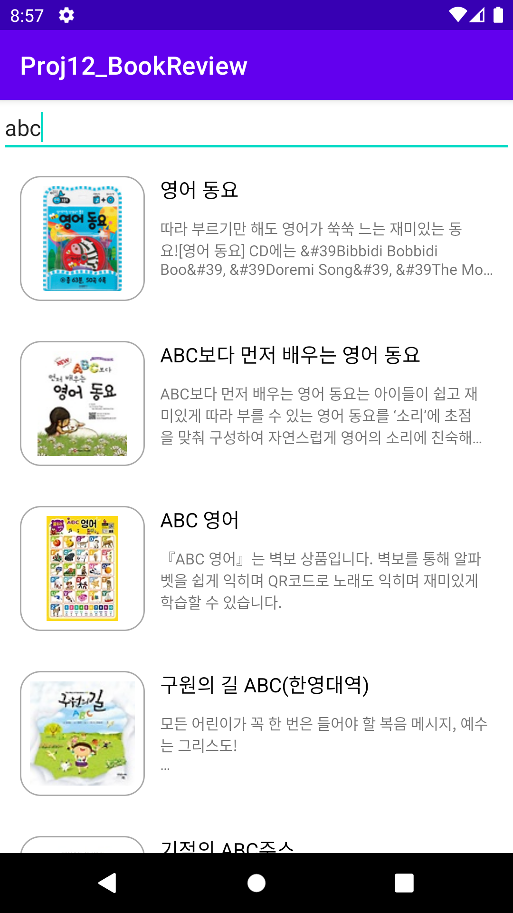

# Android Clone Coding Project #11 도서 리뷰앱
인터파크 Open API 를 통해 베스트셀러 정보를 가져와서 화면에 그릴 수 있음.
 
인터파크 Open API 를 통해 검색어에 해당하는 책 목록을 가져와서 화면에 그릴 수 있음.
 
Local DB 를 이용하여 검색 기록을 저장하고 삭제할 수 있음.
 
Local DB 를 이용하여 개인 리뷰를 저장할 수 있음.
 

# 결과화면
|Screenshot1|Screenshot2|
|---|---|
|||

 

# 배운 내용 정리
- RecyclerView 
- View Binding
- Retrofit
- Glide
- Android Room
- Open API
